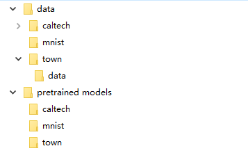

# MAU

It contains a pytorch implementation of the following paper:

* MAU: A Motion-Aware Unit for Video Prediction and Beyond.

## Requirements

To install requirements:

```
pip install -r requirements.txt
```


## Quick Start

To test our model on the Moving MNIST dataset, run the code in the PowerShell using:

```
python MAU_run.py --dataset mnist
```

To test our model on the Caltech Pedestrian dataset, run the code in the PowerShell using:

```
python MAU_run.py --dataset kitti
```

To test our model on the TownCentreXVID dataset, you should first download the [sample data](https://drive.google.com/file/d/19VXgNEiQN2iWlK5fBDmSskmOn7SBwopP/view?usp=sharing) and the [pretrained model](https://drive.google.com/file/d/17KGNf4YOQfA6abY9esqDAKYYHLS78-Tr/view?usp=sharing) and then place them in the following folders:



then run the code in the PowerShell using:

```
python MAU_run.py --dataset town
```

The predicted results will be saved into path results/.

